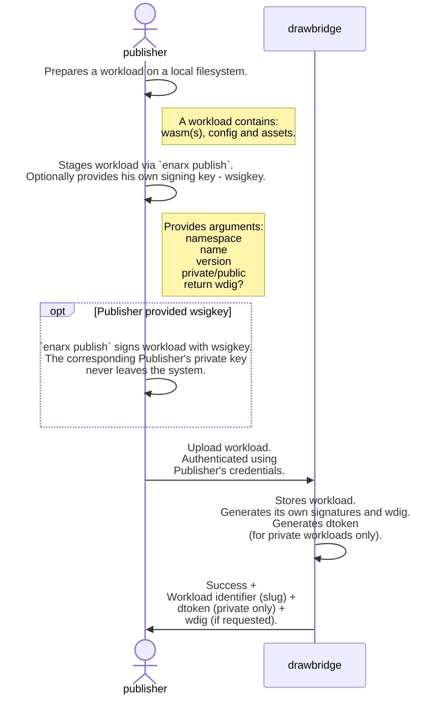
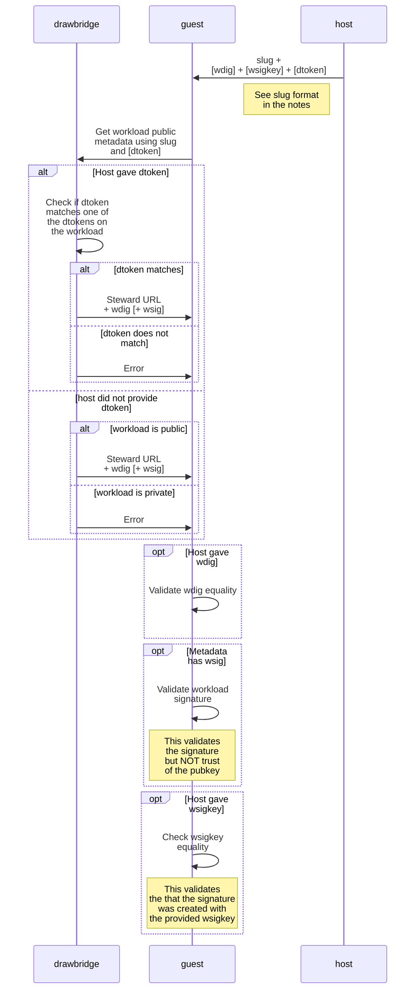
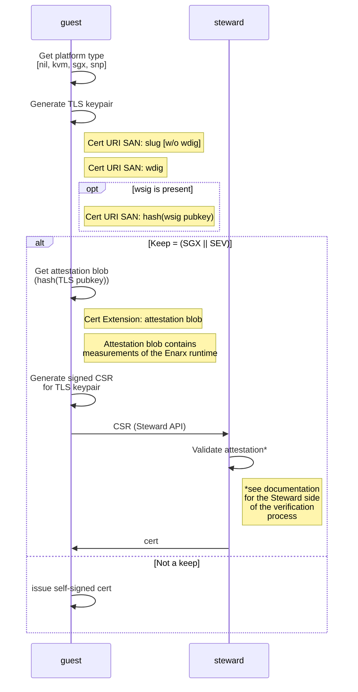
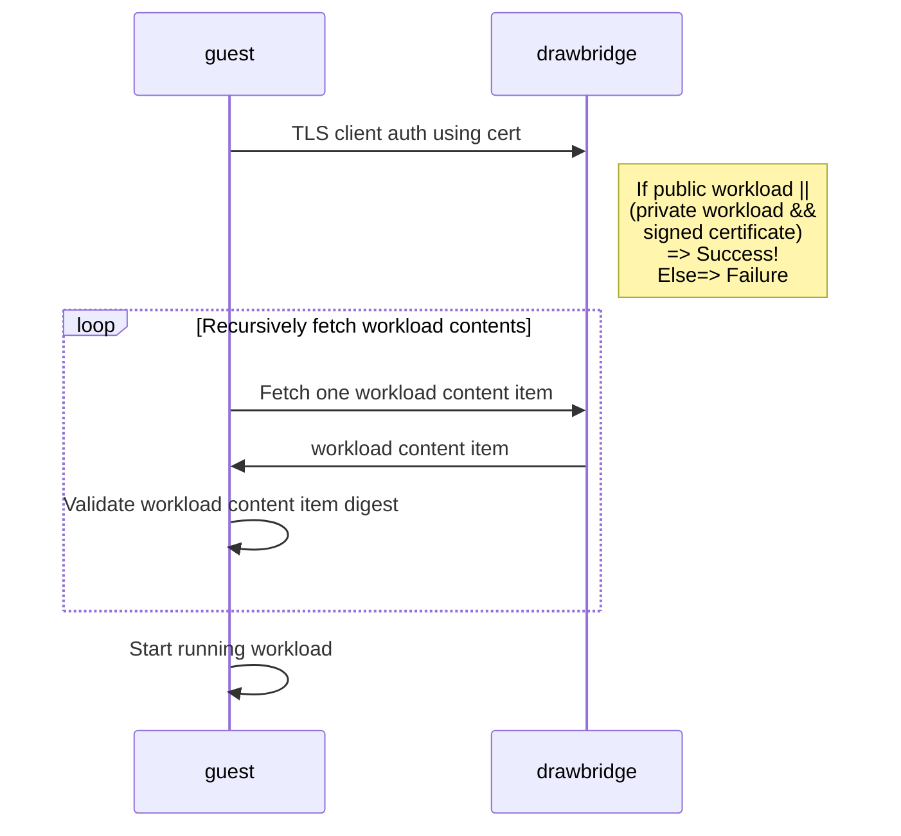
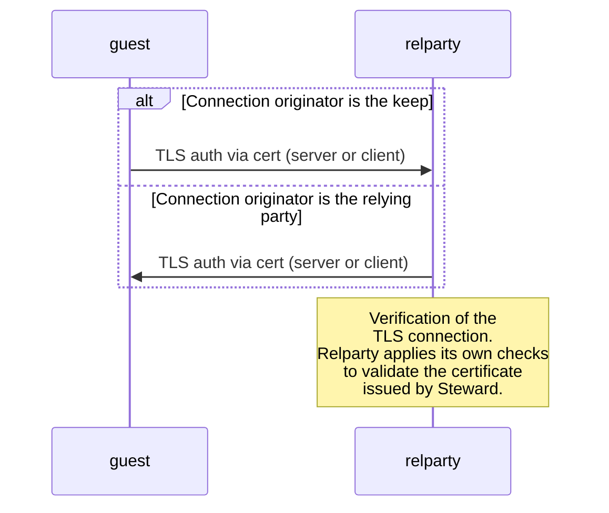

# Full Provisioning Flow with Attestation

###### tags: `Design`
| Author | Period | State |
| -------- | -------- | -------- |
| Dmitri Pal | December, 2022 | **Draft** |

## High level architecture

This document describes the detailed architecture of the Enarx attestation workflow. For a more high level view and concepts related to Confidential Computing Attestation flow please read the following [document](https://hackmd.io/KHyHqYHFTSukTOvMjW9N2Q). 

## Involved parties

* Participants:

| Name           | Purpose/Function | Optional |
| -------------- | ---------------- | -------- |
| Drawbridge     | Text             | Text     |
| Steward        | Text             | Text     |
| Host           | Text             | Text     |
| Guest          | Text             | Text     |
| Relying party  | Text             | Text     |

* Actors:

| Name           | Role/Function  |
| -------------- | -------------- |
| Publisher      | Text           |
| Administrator  | Text           |

## Prerequisites
:::danger
TODO
Update assumption about the Steward
:::

* Either:
    * *A public (Profian operated) instance of Steward service is accessible to the parties listed in the flows.*
    * *Customer deploys a private Steward service accessible to the parties listed in the flows.*
* Either:
    * *A public (Profian operated) instance of Drawbridge service is accessible the parties listed in the flows.*
    * *Customer deploys a private Drawbridge service accessible to the parties listed in the flows.*
* Drawbridge is configured to use a specific instance of Steward (in general, a customer can choose to use different instances of Steward for different workloads). By default, without any override, the deployed public or private instance of Drawbridge assumes the **public instance of Steward**. This means that a private instance of Drawbridge will work with a public or private (if deployed and configured) instance of Steward, but some instance of Steward is always required.
* Developer has created a workload and compiled it to WebAssembly generating WASM bytecode binary.

## Overall Flow

### PHASE 1 : Workload Publisher Stages Workload

* This sequence starts by the **Publisher**. **Publisher** is the person responsible for making a workload available for execution. In some cases a **Publisher** can be a developer, but in general these roles are separate.
* During this phase the **Publisher** prepares a workload and uploads it into the workload registry - **Drawbridge**.
* The sequence ends by the **Publisher** receiving the results of the upload from the registry.

:::info
Terminology:
* **wasm** - WASM bytecode, i.e. the application complied to WASM binary.
* **config** - Workload configuration data (TOML).
* **assets** - Additional data that the Publisher might want to package with the workload. This data is placed on the virtual filesystem of the keep, once the workload is delivered to the keep.
* **workload** - A **wasm** application with **config** data and **assets** data.
* **keep** - TEE with WebAssembly run-time plus Enarx logic. Keeps are where customer workloads run. For more information see the **[documentation](https://enarx.dev/docs/start/enarx)**.
* **Public workload** - a workload that can be downloaded by any execution environment without limitations. It does not require the keep to authenticate to get it.
* **Private workload** - a workload that can be released only to the keep that passed attestation security checks.
* **`enarx publish`** - The command line to talk to Drawbridge and upload the workload.
* **wdig** - The digest of the workload. This is a top level hash of the workload package stored in the Drawbridge. Different parts of the workload are stored in Drawbridge together with the **[Merkle tree](https://en.Wikipedia.org/wiki/Merkle_tree#/media/File:Hash_Tree.svg)** of hashes.
* **wsigkey** - **Publisher's** public key used to sign the workload during the upload process.
* **wsig** - the workload signature. It is created during the upload of the workload. The signature includes the public key of the **Publisher** used to create the signature - **wsigkey**.
* **Deployment token** - A random string to bind a specific workload to a specific environment where keep is running. A default deployment token is always generated and returned by Drawbridge when **Publisher** uploads a private workload.
* **slug** -  a workload identifier.
    * **Format**: [domain]/<namespace>/<workload name>:<workload version>
        * [domain] - optional part that used to construct the URL for the Drawbridge server. If omitted the default Profian server located at store.profian.com is assumed.
        * <namespace> - The logical organization that workload belongs to. The organization shares common set of users who can perform different operations within the namespace based on the defined individual permissions.
        * <workload name> - the name of the workload assigned by publisher
        * <workload version> - the version of the workload specified by publisher
    * **Example**: store.profian.com/profianinc/drawbridge:0.1.0
:::

:::danger
Todo
Update the deployment information to include the information about priming and keeping the information
Systemd service
Operator
Tool to fetch and store the CPU and related keys data.
Var/cache/Intel/SGX
var/cache/AMD-SEV - local machine certificate in the cert chain for attestation it comes from AMD and needs refreshed periodically after the firmware update
Vendor information
Top part of the chain is baked into Steward
Middle and bottom is needed
Bottom is generated 
Middle is not keep specific
Middle part of the chain is CPU information
VCEK certificate
PCK certificate
Certificate chain CRL
Store as is what we fetched
:::
    
    
    

:::success
**Notes:**    
* If the signing key pair is not provided by **Publisher**, no signature is created. The signing provides an extra level of security to prove that the workload has not been tampered with. It is optional. It is highly recommended for the production workloads but can be omitted in development.
* To limit the deployment of the specific workloads to specific environments, **Publisher** can define additional deployment tokens for different environments. The API and CLI to do this are out of scope of this document. 
    * Additionally the doployment tokens (**dtokens**) can be:
        * Valid for a specific time, i.e have an expriation date
        * Valid for a number of uses, for example sinlge use or limited number of launches.
        * Revoked by **Publisher**
        * Updated by **Publisher** to change/extend lifetime or number of uses 
    * The details of the deployment token managment are out of scope of this document. 
    
* As a result of this phase the **Publisher** is expected to collect the following information and make it available later at **PHASE 3**.
    * **slug** - it will be used as a required argument for workload deployment.
    * **dtoken** - Deployment token required for private workloads only.
    * **wsigkey** - the **Publisher's** public key used to sign the workload. An optional argument at **PHASE 3**.
    * **wdig** - the hash of the workload as **Drawbridge** knows it. An optional argument at **PHASE 3**.
:::

### PHASE 2 : Provisioning of Enarx Binaries

The Enarx binaries include two parts:
* The client side part that, i.e. Enarx client, - the CLI that runs on a host
* The bits that run in the keep:
    * Low level shim that abstracts the hardware
    * WebAssembly run-time - WasmTime
    * Enarx keep logic

In phases shown below, the Host refers to the full system that hosts Enarx CLI. The Guest refers to the "Enarx keep logic" deployed into TEE on the target host together with shim and run-time.

The provisioning of the Enarx bits happens outside the attestation flow and is not demonstrated below. In general the Enarx bits need to be somehow delivered or installed on the target system - host. The delivery mechanism varies, depending on customer preferences.

The primary options are:
* Enarx binaries are installed on the host using RPM or a similar packaging system. This can be orchestrated by some provisioning and/or automation tools or done manually.
* Enarx binaries are packaged in a container, and the container is deployed towards a target node. The mechanism of how it is done (Docker, Kubernetes or something else) is not relevant here.

As a result the bits are installed on a target host and ready to accept a workload.

:::success
**Notes:**
* This phase can be done anytime before **PHASE 1**.
:::

### PHASE 3 : Deploy and Run Workload with Attestation

This phase is broken into sub-phases for readability of the diagrams. The sub-phases in this phase are a part of the single uninterrupted flow.

#### PHASE 3a : Get and Validate Package Metadata

* This phase starts with the invocation of the Enarx CLI on the **Host**. The CLI can be involved manually or using some other tools or automation. The nature of this invocation is irrelevant to the flow.
* The CLI starts the workflow using `enarx deploy slug` command. From this point on, the CLI is blocked waiting for the workload to exit. If an error is encountered in any part of the flow below, the Enarx keep (the **Guest**) exits and the error is returned to the CLI (the **Host**).
* The goal of this phase is to make sure that the **Guest** has the right metadata and that the metadata is correct.
* The phase ends when the **Guest** finishes the preliminary checks or determines that no checks are possible.

:::danger
TODO
Steward URL is optional and defined by the TOML file for the workload
:::
    
:::success
**Notes:**
* Providing optional arguments helps to reduce attack surface in different scenarios.
    * **wdig** is optional to pass from the host. Having a **wdig** passed to host out of band helps to make sure that the workload has not been tampered with by hajacking Drawbridge or spoofing DNS. It adds a level of security and is highly recommended for production deployments of private workloads.
    * **wsigkey** is optional to pass from the host. Having a **wsigkey** passed to host out of band helps to make sure that the workload has not been tampered with by replacing the workload in Drawbridge by someone who hijacked **Publisher's** account in Drawbridge. It is highly recommended for private production workloads.
    * **dtoken** is optional for public workloads and required for private workloads to make sure that the workload is allowed to be released to the specific environment, the host that run the keep. **dtoken** should be delivered to the host out of band and viewed as a secret that grants the environment the right to run the workload. If **dtoken** is stolen and used in another environment, that environment would be able to launch the workload. While the attacker would not be able to get inside the workload and see its data, he would be able to observe the workload behavior from the outside in the environment he controls. 
* Any failure to check **wdig** or **wsig** is fatal.
* **wdig** is only validated if **Host** provided it as apart from the command line, otherwise no check is conducted.
* **wsig** contains the public key of the **Publisher**. The key is extracted from the **wsig** and then the signature is verified. This is the semantic verification. At this point there is no verification that the signing key, the **Publisher** used, is trusted.
  ::: 

#### PHASE 3b: Establish Workload Identity

After completing validations described in the previous phase, **Guest** establishes the workload identity.

* The phase starts with the **Guest** collecting necessary data.
* The goal of the phase is to acquire a certificate.
* Depending on the configuration the phase ends with the **Guest** having a PKI pair with a certificate either signed by Steward, in case the keep is deployed into a real TEE or with the self-signed certificate, if the keep is outside the real TEE. The latter is used for testing and development and not recommended as a part of the production workflow.

:::info
Terminology:
* **CSR** - Certificate Signing Request
* **SAN** - Subject Alternative Name
* **attestation blob** - is a blob returned by the hardware. Its format is highly hardware implementation specific. The data blob contains the input signed by the key in embedded in hardware and other data including the certificate chain. The certificate chain can be extracted from this blob and validated at the later stages.
  :::

:::danger
TODO
Do privately signed certificate every time
Send it instead of CSR to Steward in case of a real Keep
Steward parses , verifies and signs, sends back a Steward sign cert
There is one private key with two certs
The workload will be able to choose which one to use with relying party
    Self-signed cert without the attestation blob is the complete leap of faith and should not be used in production

    AMD ASN1 code needs to support cached CRLs
    We package as a part of different binary blobs of the same extension using ASN1
    ASN object will have a s
    Additional field for CRLs
    
:::
     
    
:::success
**Notes:**
* The platform type is determined by a system call with NULL storage argument. The call returns the type of the keep. At the moment of writing the real keeps are SGX and SEV. Other types of keeps will be supported in the future.
* CSR includes the SAN with URIs of: **slug**, **wdig** and optionally the hash of the **wsig pubkey**. The hash is used for compactness since **wsig pubkey** (and **wsig** it is extracted from) can be quite big.
* The **attestation blob** is placed into a separate extension
* The CSR request to **Steward** is a simple API call. There is no sense to make this protocol to adhere to any standard. Following a standard assumes that there might be alternative implementations of **Steward**. However, since the operation the **Steward** performs is very specific for the flow, there is no sense to have an alternative implementation.
* [**Steward** documentation](https://hackmd.io/KHyHqYHFTSukTOvMjW9N2Q) mentioned in the diagram.
* [Code to place the extension into the CSR](https://github.com/profianinc/steward/blob/main/crates/snp_validation/src/lib.rs#L25-L31)
:::

#### PHASE 3c: Download and Execute Workload

* This part of the flow starts when **Guest** acquired or generated a self-signed cert.
* The goal of this phase to acquire and download the workload
* The phase ends with the running workload.

:::success
**Notes:**
* If **Guest** is requesting a public workload, the signed certificate is not required. The workload will be released to a request with a self-signed cert. A private workload requires a properly attested and signed certificate. 
:::

#### PHASE 3d: Attest to Relying Parties
    
* This phase is workload specific.
* It starts with the workload running and defining a socket to either connect to external service or accept an external connection.
* The phase ends when the workload is optionally attested by the relying party defined by the deployment.

:::success
**Notes:**
* It is highly recommended to make the workload connect to the relying party in some way. The validation of the Steward issued certificate is the final step verifying that all the elements of the flow have been executed and nothing has been hijacked or tampered with.
* It is expected that the workload would either set a socket for external client to connect to it or will make a connection itself to some other service. The protocol of this connection is workload specific. The connection is enforced by Enarx to be TLS and controlled by the workload policy specified in the TOML file, which is downloaded as a part of the application. The policy expressed in the TOML file would define what keys should be used for the TLS connection and how. This means that the peer will be able to act as a relying party and perform the certificate validation during the handshake the way it prefers. The secondary keys can be then downloaded by the application over this connection giving the workload an ability to authenticate against some other service with this secondary keys. How the downloaded secondary secrets become a part of the Networking policy for other sockets opened later is out of scope of this document.
* If the workload acts as a server is accepting connections, its hostname is a part of the networking configuration of the host. It should be defined and communicated to the relying party out of band using standard procedures that are outside the scope of this document.
:::
